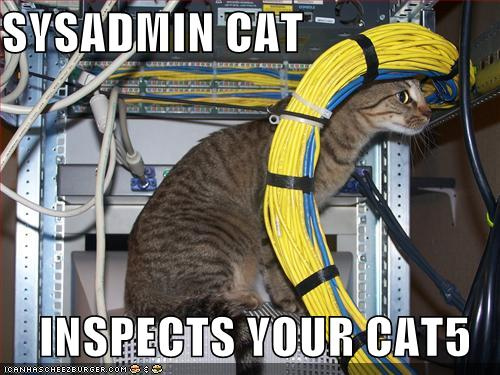

!SLIDE center
# Meet the Problem #

.notes Sick of config doco on the team wiki?

!SLIDE bullets
# Environment Provisioning #

* What version of the IDE are we using?
* Have I cloned the repo yet?
* Have I got the right tools to compile my source?

.notes Think of it as a "build" for your environment

!SLIDE bullets incremental
# Configuration is Code! #

* you version your source code
* you version your database schema
* you might even version your CI config

!SLIDE center
# If Ops can do it... #

!SLIDE bullets
# Why Can't We? #

* enter babushka!